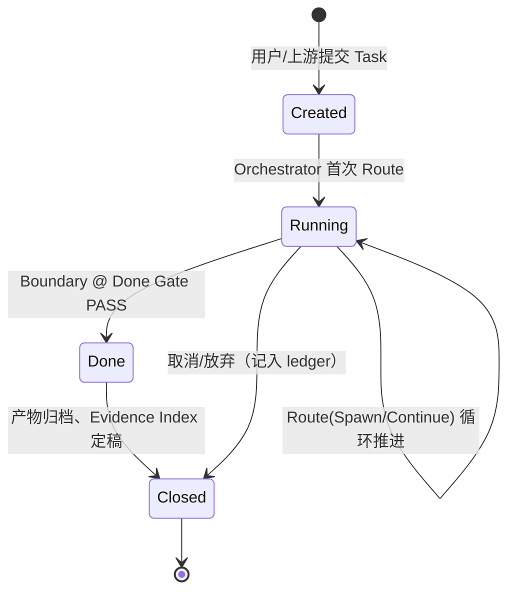
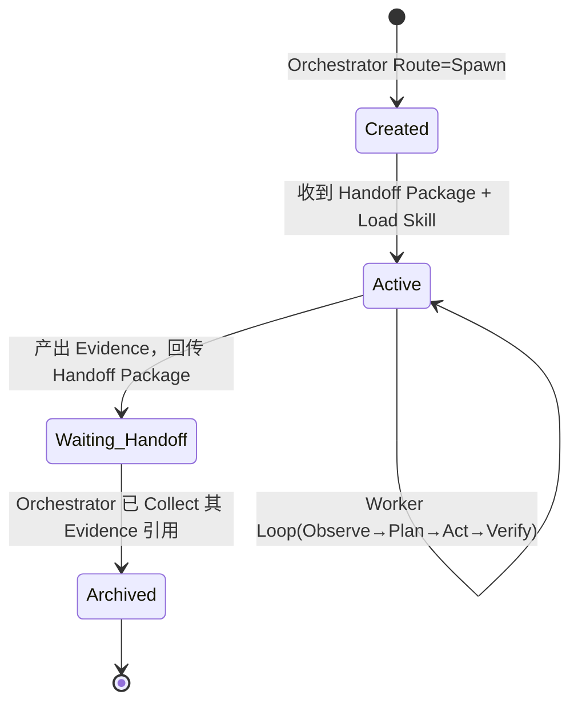
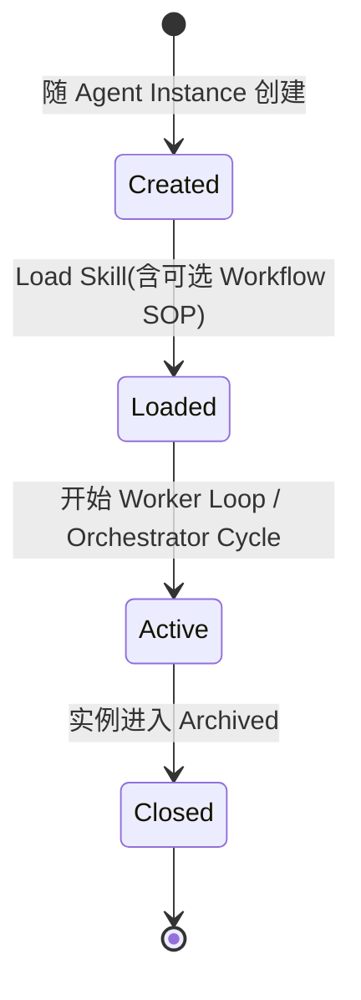

# RFC-001: Runtime Lifecycle（运行时生命周期）

| 字段 | 值 |
| --- | --- |
| **Status** | Frozen Candidate — 按节携带 Evidence Status（见 RFC-000B §2），整篇转 Frozen 须 §8 各判据均有实证 |
| **Version** | 0.2（v0.1 + RFC-000B 协议应用：节级实证标注） |
| **Created** | 2026-07-29 |
| **Depends on** | RFC-000（Scope）、RFC-000A（Terminology, Frozen）、RFC-000B（Admission Protocol, Active） |
| **性质** | 本 RFC 写**状态契约（State Machine as Specification）**，不写 Prompt、不写 Scheduler 实现（见 RFC-000 §2.1）。 |

> **本 RFC 冻结三层生命周期**：`Task` → `Agent Instance` → `Context`，以及它们之间的转换触发器（Spawn / Continue / Archive / Handoff Trigger）。
>
> **职责边界**：本 RFC 定义 **WHEN**（何时创建/交接/归档）；RFC-002 只定义 **WHAT**（Handoff Package 里装什么）。二者不重叠。

---

## 1. 三层生命周期总览

```
Task Lifecycle          （最外层，最长寿）
  Created → Running → Done → Closed
    │ realized-by（follows Workflow）
    ▼
Agent Instance Lifecycle
  Created → Active → Waiting-Handoff → Archived
    │ owns（1:1，终生）
    ▼
Context Lifecycle
  Created → Loaded → Active → Closed
```

**不变量（承 RFC-000A §1，MUST）**：一个 Agent Instance 终生绑定一个 Context；二者的生命周期**同生共死**（Context Closed ⟺ Instance Archived）。Task 则跨越多个 Agent Instance 而持续。

---

## 2. Task Lifecycle `[Derived — 骨架经 RI-BUGFIX-001 真实运行，状态边未逐条单项验证]`



| 状态 | 含义 | 进入条件 | 强制约束（MUST） |
| --- | --- | --- | --- |
| **Created** | 已登记，未开工 | Task 入 ledger | 必须有唯一 task_id |
| **Running** | 正被一串 Agent Instance 推进 | Orchestrator 首次 Route | 任一时刻**至多一个** Agent Instance 处于 Active（v1 串行，见 §6） |
| **Done** | 通过 Done Gate | Boundary 校验 evidence 通过 | 进入 Done **必须**有可解引用的 Evidence Index |
| **Closed** | 终态，产物归档 | Done 后归档 / 或被取消 | Closed 后 Task **不可再** Route |

> **Task 是连续对象**：Agent Instance 换了多少次，Task 状态与 task_id 不变——这是"为什么 Agent 换了"的答案。

---

## 3. Agent Instance Lifecycle `[Derived — §3.1 除外，见下]`



| 状态 | 含义 | 强制约束（MUST / MUST NOT） |
| --- | --- | --- |
| **Created** | 实例已派发，尚未 brief | 必带一个新 Context（不复用他人 Context） |
| **Active** | 正在 Worker Loop 内工作 | 只能改**自己 Context 可见**的 Workspace；产物必须落成 Evidence（P4），不得只存在于对话中 |
| **Waiting-Handoff** | 已产出，等 Orchestrator 收编 | **MUST NOT** 再改 Workspace（冻结产物，保证 Evidence 可核验）；回传只给 Handoff Package（含 Evidence 引用），**不回传对话** |
| **Archived** | Context 已关闭 | Archived 后**不可**被"唤醒续用"——续做只能 Spawn 新实例（无 Context Refresh） |

### 3.1 Archive 触发点（回答上一轮的开放问题） `[Validated @ RI-BUGFIX-002]`

> **何时 Archive Backend#1？** —— 答案：**在它进入 Waiting-Handoff 且 Orchestrator 完成 Collect（登记其 Evidence 引用）之后立即 Archive。**

- **不是**"Spawn 成功即 Archive"（那样产物还没落盘）。
- **不是**"等 Review 通过才 Archive"（那样 Backend#1 的 Context 会被无谓吊住，占资源、诱使唤醒续用）。
- **正是**"回传 + 收编完成即 Archive"：产物已在 Evidence Index 里，Context 使命完成，立即关闭。若后续 Review 打回，**Spawn Backend#2**（新 Context），而非唤醒 #1。

这条直接保证了 RFC-000A 的 `无 Context Refresh` 与 `1 Instance = 1 Context`。

> **✅ 实证（RI-BUGFIX-002）**：REJECT 回环已用真实 spawn 的隔离子 Agent 跑通——
> Reviewer#1 独立重跑判 REJECT，Orchestrator Spawn 出**全新** Worker#2（新 Context，仅带 `reject_reason`，
> 无法访问 Worker#1 上下文），续修后 Reviewer#2 判 PASS。本节从"推导"升级为"验证"。
> 证据：`reference/joycode/bugfix-reject/`。

---

## 4. Context Lifecycle



| 状态 | 含义 | 约束 |
| --- | --- | --- |
| **Created** | 空上下文 | 与实例 1:1 同时诞生 |
| **Loaded** | 已加载 Skill | Skill 是 per-context 知识；此步决定该实例"会什么" |
| **Active** | 承载循环 | Worker 跑 Loop；Orchestrator 跑 Cycle |
| **Closed** | 关闭回收 | 与实例 Archived 同步；**Context 内容不回收进 Orchestrator**（见 §5） |

---

## 5. 转换触发器：Spawn / Continue（Route 的两分支） `[Validated @ RI-BUGFIX-001 — A-2（Spawn=独立判断 MUST）、B-2（Orchestrator Context 不随 worker 数增长）两判据实测通过]`

Orchestrator 在 **Orchestrator Cycle** 的 Route 步产出以下之一（承 RFC-000A）：

| 触发器 | 等级 | 条件 | 结果 |
| --- | --- | --- | --- |
| **Spawn** | **MUST** | 需要**独立判断**（评审/验收）——成本无投票权 | 新 Agent Instance + 新 Context + Handoff |
| **Spawn** | **SHOULD** | 当前 Context 接近窗口上限（相对量，RFC-000 P-6）；或存在**认知冲突领域**（栈污染） | 同上 |
| **Continue** | **默认** | 无上述触发 | 留当前 Instance/Context 继续 Worker Loop |
| **Finish** | — | Task 达 Done Gate | Task → Done |

**Orchestrator 的 Context 约束（MUST，承 RFC-000A）**：

> **`Orchestrator MUST NOT accumulate execution history in its own Context.`** Collect 步**只登记 Evidence 引用**至 Evidence Index，按需解引用；**禁止**把 worker 产物、日志、对话内联进 Orchestrator Context。否则跨 A1→A2→A3 其 Context 单调膨胀，多 Agent 省 Context 的收益归零。

---

## 6. Handoff Trigger：何时交接（WHEN） `[Derived — 触发点 1/2 随生命周期骨架经 RI-001 运行；触发点 3（溢出续接）从未被真实触发，RI-BUGFIX-001 明确记录"任务太小未触发"]`

> 本节只定 **WHEN**；Handoff Package 的**结构（WHAT）**归 RFC-002。

Handoff（跨 Context 状态转移）**只在**以下时刻发生，**没有第四种**：

1. **Spawn 交接**：Route=Spawn 时，Orchestrator → 新 Instance 下发 Handoff Package。
2. **回传交接**：Instance 进入 Waiting-Handoff 时，Instance → Orchestrator 上交 Handoff Package（含 Evidence 引用）。
3. **溢出续接**：Active 实例 Context 接近上限时，Route=Spawn 一个**后继同类实例**，经 Handoff 续做（这就是"无 Context Refresh"的落地路径）。

**MUST（承 RFC-000 P-9）**：以上每一次交接**只能**经 Handoff Package（briefing prompt + 共享文件/ledger）；**MUST NOT** 依赖对话继承、隐式上下文、模型"自己记得"。

---

## 7. v1 范围声明（Non-Goals）

- **v1 串行**：任一 Task 在任一时刻至多一个 Active worker Instance。并行（fork/join）留待后续版本，**不在 v1 预留抽象**（遵循 RFC-000 Simple First）。
- 本 RFC **不**定义 Handoff Package 字段（RFC-002）、不定义 Loop 内部推理规范（RFC-003）、不定义 Boundary 具体实现（RFC-005 + Binding）。

---

## 8. Conformance（本 RFC 的可核验判据）

一个实现要合规于 RFC-001，MUST 可观测地满足：

1. 存在 task_id，且 Task 状态转换只走 §2 允许的边。`[Derived]`
2. 每个 Agent Instance 恰好 1 个 Context，Archived 后不可续用（可通过"是否存在唤醒旧 Context 的路径"证伪）。`[Validated @ RI-BUGFIX-002 — REJECT 回环：Reviewer#1 判 REJECT 后 Spawn 全新 Worker#2，未唤醒 #1]`
3. Waiting-Handoff 实例不再改 Workspace（产物冻结可核验）。`[Derived]`
4. Orchestrator Context 大小**不随** worker 数量单调增长（可测：跑 N 个 worker，Orchestrator Context 增量应仅为 Evidence Index 引用，而非产物内容）。`[Validated @ RI-BUGFIX-001 — B-2]`

---

*RFC-001 v0.2 — Frozen Candidate。转 Frozen 前置条件：判据 1 / 3 各获 ≥1 次实证（判据 2 / 4 已达标）。原 v0.1 尾注"待 Runtime Sequence Diagram 复核"已由 RI-BUGFIX-001 生命周期骨架 A/B 全绿完成。*
