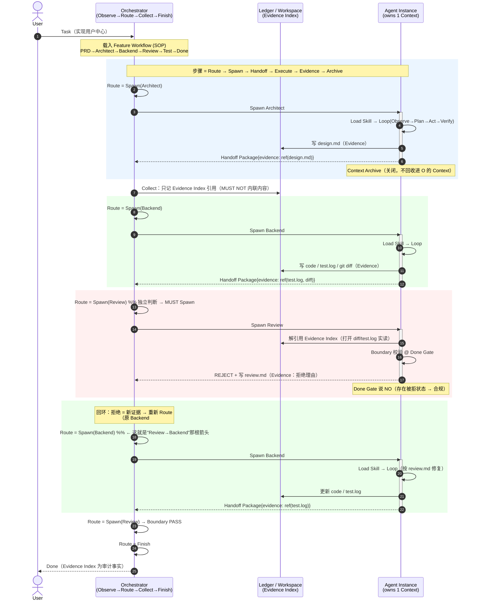
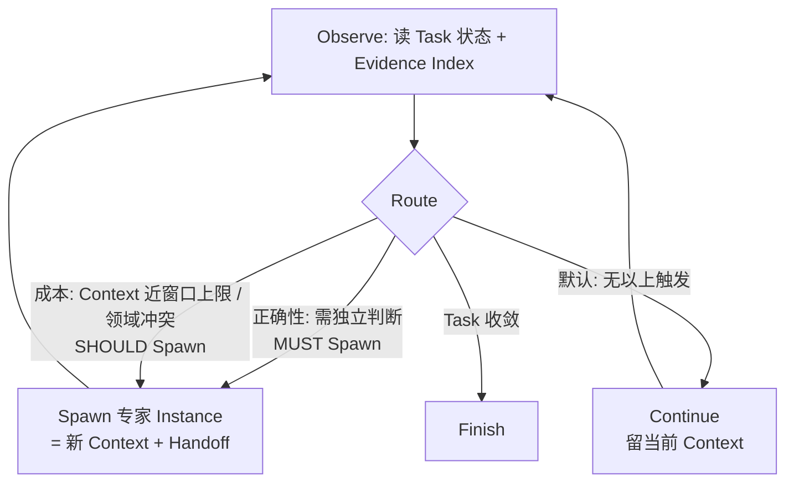

# Runtime Sequence Diagram —— RFC-000A 的"单元测试"

| 字段 | 值 |
| --- | --- |
| **Status** | Draft |
| **Created** | 2026-07-29 |
| **作用** | 验证 RFC-000A 术语是否**足以描述整个运行时而无需引入新名词**。每根箭头都必须只用已冻结术语标注；若某根箭头画不出，说明 000A 有洞。 |
| **验收判据** | (1) 全部箭头可画；(2) 只用 000A 术语；(3) 含 Boundary 拒绝回环；(4) 不出现新名词。 |

---

## 1. 主时序图（Feature，含 Boundary 拒绝回环）

> 全程只用 000A 术语：Task / Workflow / Route / Spawn / Agent Instance / Context / Handoff Package / Evidence Index / Boundary / Done Gate / Archive。

---

## 2. Route 决策放大图（Continue / Spawn / Finish）

---

## 3. 画图结论 —— 术语够不够？

**能画出来的（术语通过）：**

- ✅ 那根被反复点名的 **`Review → Backend` 回环**画得出——它在术语里是 `Boundary REJECT → review.md 成为 Evidence → O 重新 Route → Spawn Backend #2`。回环**验证了 `1 Instance = 1 Context`**：打回的不是原 Backend#1（已 Archive），而是带着 `review.md` 引用的**新实例**。无需 "Context Refresh"，无需新名词。
- ✅ Evidence 全程只走 Index 引用，Orchestrator 未内联内容——`MUST NOT accumulate history` 可视化成立。
- ✅ Handoff Package 是唯一跨 Context 通道；Review 靠"解引用 Index"读到 Backend 的产物,而非"看见 Backend 的对话"。

**画图暴露的一处待补（这正是单元测试的价值）：**

- ⚠️ **"Loop" 一词有作用域重载**：图里出现**两个**循环——Orchestrator 的 `Observe→Route→Collect→Finish`（跨 Context 的路由循环）与 worker 的 `Observe→Plan→Act→Verify`（单 Context 内推理）。000A §2.5 只定义了后者。**建议 RFC-003 明确区分 `Orchestrator Cycle` 与 `Worker Loop`,避免"Loop"被当成同一个东西。** 这不是新概念，是给已有的两处循环各自正名。

**结论**：除"Loop 作用域"一处需在 RFC-003 澄清外，RFC-000A 术语**足以描述整个运行时,未引入任何新名词**。可据此把 000A 由 Candidate 转 **Frozen**。
