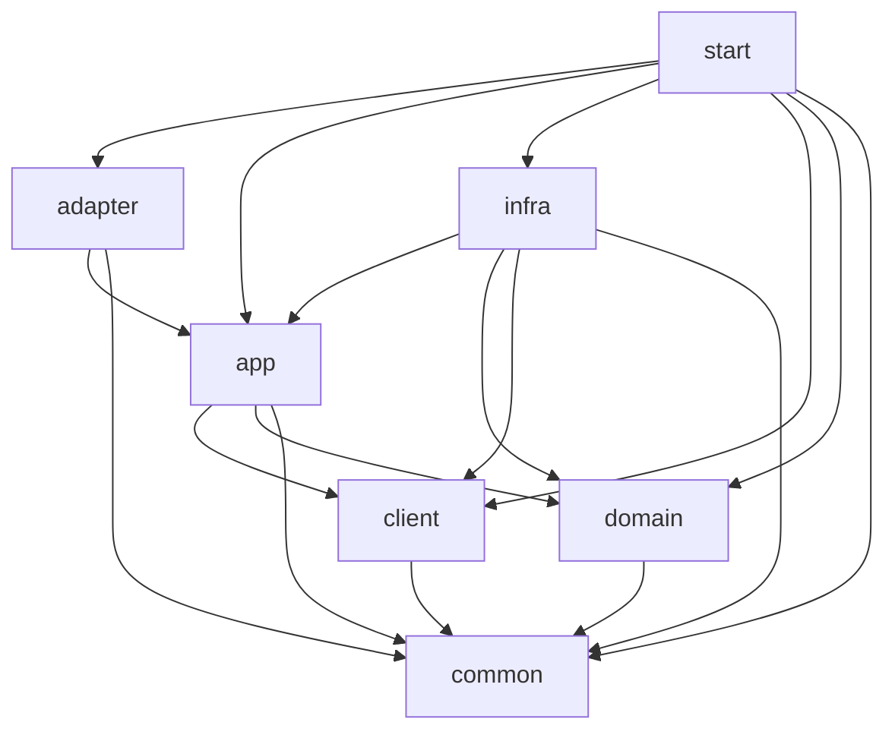

> 【ACRS 资产】源：fin-buddy 工程规范 guardrails/java-app（commit 676aab9，2026-09-21 脱敏复制）。中间件/包名已通用化映射，映射表见本目录 [README.md](README.md)。文内指向 scaffolds / feedback / AGENTS.md / conventions 的相对链接属源仓库附件，未随资产分发。

# 架构约束

> 全景样例 → [`reference-implementation.md`](reference-implementation.md)（8 模块目录树、包命名、类命名、DomainService 形态）。
> 本文只列可执行约束（ARCH-01 ~ ARCH-17）。

---

## ARCH-01: 8 模块结构

**MUST** 所有系统遵循以下 8 模块结构：

```
{system}-client      # 对外契约 jar：Facade 接口 + Request/Response DTO；不放 enum / 返回码 / 内部交易模式
{system}-adapter     # 应用入口聚合器（按需）：controller/（有 REST 时）+ consumer/（有 MQ 时）+ scheduler/（有定时任务时）
{system}-app         # 应用编排：Facade 实现 + AppService + Gateway 接口定义（业务语义）+ 事务 + 幂等 + Command/Result + converter
{system}-domain      # 领域层：聚合根 + statemachine + DomainService + Repository 接口 + XxxResultInfo/Reason 数据载体
{system}-infra       # 基础设施实现：Repository/Gateway 实现 + Mapper + PO + Channel Client + MQ Producer + Redis + ID + Converter
{system}-start       # AppBoot 启动入口 + 装配
{system}-common      # 极少量通用基础能力（慎用；业务 DTO / Repository / Gateway / 枚举 / 常量不进 common）
{system}-test        # 跨模块集成测试 + ArchUnit 架构约束测试；模块内单测放各自模块
```

| 模块 | 职责 | 关键类型 |
|------|------|---------|
| **client** | 对外契约 jar（可独立发布） | Facade 接口、Request/Response DTO、通用响应基类 |
| **adapter** | 应用入口聚合器（按需子包） | Consumer + Message + Scheduler + Controller（可选）+ 入口 converter |
| **app** | 应用编排 + Gateway 接口定义 | FacadeImpl、AppService、AppServiceImpl、Command、Result、Gateway 接口（业务语义）、FacadeConverter、GatewayConverter |
| **domain** | 领域模型 + 领域规则 | Aggregate、DomainService、Repository 接口、statemachine（Status + Event 枚举）、`XxxResultInfo` / `XxxReason` |
| **infra** | 基础设施实现 | RepositoryImpl、Mapper、PO、`{Entity}Converter`（PO↔DomainModel）、Channel Client/Request/Response、Channel GatewayImpl、MQ Producer/Message、Redis Lock/Idempotency、ID Generator |
| **start** | 启动入口 | `{System}Application`、`{System}BootstrapConfiguration` |
| **common** | 极小通用能力 | 通用异常基类、通用错误码、慎加工具类 |
| **test** | 跨模块测试 | `@SpringBootTest` 集成测试、ArchUnit 架构约束测试 |

---

## ARCH-02: 依赖方向

**MUST** 遵循以下模块依赖方向，禁止逆向依赖：



| 模块 | 可依赖 | MUST NOT 依赖 |
|------|--------|--------------|
| **adapter** | app、common | client、domain、infra |
| **app** | client、domain、common | adapter、infra |
| **domain** | common | client、app、adapter、infra |
| **infra** | app、domain、client、common | adapter、start |
| **client** | common | adapter、app、domain、infra |
| **common** | vendor 的共享内核 `com.company.fin.share.kernel.*`（见 [scaffolds/java-app/shared-kernel/reference.md](../../scaffolds/java-app/shared-kernel/reference.md)） | 其他任何内部模块 |
| **start** | 全部（负责装配） | — |

**关键约束**：

1. **domain 不依赖 infra**：Repository 接口在 domain，实现在 infra，Spring 反向注入
2. **app 不依赖 infra**：Gateway 接口在 app，实现在 infra，Spring 反向注入
3. **adapter 只依赖 app**：Consumer / Scheduler / Controller 通过 AppService 触达 domain，不绕过
4. **domain 保持纯净**：不依赖 client（不引 Request/Response DTO）；DomainService 参数 MUST 是 domain 内类型（见 [`anti-patterns.md`](anti-patterns.md) AP-24）

---

## ARCH-03: PO 定义在 infra，业务逻辑禁止在 PO

**MUST** PO（DB 映射对象，类名 `{Entity}PO`）定义在 `{system}-infra` 模块的 `po/` 子包下。

**MUST NOT** PO 持有业务逻辑（业务规则校验、状态推进、金额运算等）。业务行为属于 DomainModel。

**MUST** PO ↔ DomainModel 转换由 `{Entity}Converter`（MapStruct，**不带 `Domain` 后缀**）完成，放在 `{system}-infra/{biz}/converter/`。

**MUST NOT** 把 Converter 放在 domain 层（违反者见 [`anti-patterns.md`](anti-patterns.md) AP-25）。

```java
// 错误：业务方法写在 PO 上
@TableName("pay_order")
public class PayOrderPO {
    public boolean canRefund() { ... }           // ❌ 业务逻辑应在 DomainModel
    public Money calculateOverdueFee() { ... }   // ❌ 同上
}

// 正确：PO 仅做 DB 映射；业务行为在 DomainModel
@TableName("pay_order")
@Data
public class PayOrderPO {
    private String payOrderNo;
    private BigDecimal amountValue;
    private String amountCurrency;
    private String currentStatus;
}

public class PayOrder extends BaseDomainModel<PayOrderStatus, PayOrderEvent> {
    public boolean canRefund() { ... }           // ✅ 业务行为在 DomainModel
}

// Converter 位于 infra/{biz}/converter/
@Mapper(componentModel = "spring")
public interface PayOrderConverter {
    PayOrder toDomainModel(PayOrderPO po);
    PayOrderPO toPO(PayOrder payOrder);
}
```

---

## ARCH-04: Mapper 不出 infra 层

**MUST NOT** 在 `{Entity}RepositoryImpl` 之外调用 Mapper。

**MUST** 目录结构（单一 infra 树；全景样例见 [`reference-implementation.md`](reference-implementation.md)）：

```
{system}-infra/{biz}/
├── repository/       # Repository 实现（domain 接口的实现）: {Entity}RepositoryImpl.java
├── mapper/           # MyBatis-Plus Mapper（只被 RepositoryImpl 引用）: {Entity}Mapper.java
├── po/               # PO（@TableName + 类名 *PO）: {Entity}PO.java
├── converter/        # PO ↔ DomainModel Converter（MapStruct）: {Entity}Converter.java
└── channel/          # 外部渠道实现（有渠道调用时）
    ├── gateway/      # 渠道 Gateway 实现（app 接口的实现）: Channel{Biz}GatewayImpl.java
    ├── client/       # 渠道 Client
    ├── request/      # 渠道原始请求
    ├── response/     # 渠道原始响应
    └── converter/    # 渠道 request/response ↔ app gateway command/result

{system}-infra/mq/     # 有 MQ 时：gateway（通用 gateway 实现）+ producer（底层 MQ Producer）+ message + converter
{system}-infra/redis/  # 需要分布式锁 / 幂等时（RedisTradeLockGateway / RedisIdempotencyGateway）
{system}-infra/id/     # ID 生成器实现（SnowflakeTradeIdGenerator）
```

---

## ARCH-05: 包命名

**MUST** 包路径格式：`com.company.{system}.{layer}[.{biz}].{sublayer}`。`com.company` 是默认组织包名，可在工程标识确认（`scaffolds/java-app/module-structure.md` §0.1）时替换为实际组织包名；**MUST NOT** 用 `com.example.*` / `com.xxx.*` 等占位包名落地。

**MUST** 状态机包名统一 `statemachine`（不写 `statusmachine`）。

```
com.company.{system}.client.facade
com.company.{system}.client.{biz}.request
com.company.{system}.client.{biz}.response

com.company.{system}.adapter.consumer.{biz}          # 有 MQ 消费
com.company.{system}.adapter.scheduler.{biz}         # 有定时任务
com.company.{system}.adapter.controller.{biz}        # 有 REST 接口时

com.company.{system}.app.{biz}.facade.impl           # FacadeImpl
com.company.{system}.app.{biz}.service               # AppService 接口
com.company.{system}.app.{biz}.service.impl          # AppServiceImpl
com.company.{system}.app.{biz}.command
com.company.{system}.app.{biz}.result
com.company.{system}.app.{biz}.converter             # FacadeConverter / GatewayConverter
com.company.{system}.app.{biz}.gateway               # 业务 Gateway 接口 + command / result
com.company.{system}.app.common.gateway              # 通用能力 Gateway（notify / event / lock / idempotency / id）

com.company.{system}.domain.{biz}.model              # 聚合根
com.company.{system}.domain.{biz}.repository         # Repository 接口
com.company.{system}.domain.{biz}.service            # DomainService + XxxResultInfo / XxxReason
com.company.{system}.domain.{biz}.statemachine       # Status / Event 枚举
com.company.{system}.domain.{biz}.enums              # 领域枚举

com.company.{system}.infra.{biz}.repository          # RepositoryImpl
com.company.{system}.infra.{biz}.mapper              # Mapper
com.company.{system}.infra.{biz}.po                  # PO（@TableName + 类名 *PO）
com.company.{system}.infra.{biz}.converter           # PO ↔ DomainModel Converter
com.company.{system}.infra.{biz}.channel             # 渠道相关
com.company.{system}.infra.mq                        # MQ 相关
com.company.{system}.infra.redis                     # Redis 实现
com.company.{system}.infra.id                        # ID 生成
```

---

## ARCH-06: 类命名速查

**MUST** 按以下模式命名：

| 组件 | 命名模式 | 示例 | 所在模块 |
|------|---------|------|---------|
| 对外 Facade 接口 | `{Biz}Facade` | `TradePaymentFacade` | client |
| Facade 实现 | `{Biz}FacadeImpl` | `TradePaymentFacadeImpl` | app |
| Request/Response DTO | `{Op}{Biz}Request/Response` | `PaymentRequest` / `RefundResponse` | client |
| REST Controller（可选） | `{Biz}Controller` | `PaymentAdminController` | **adapter** |
| MQ Consumer | `{Biz}{Event}Consumer` | `PaymentResultConsumer` / `PreAuthResultConsumer` | **adapter** |
| MQ 消息对象 | `{Biz}{Event}Message` | `PaymentResultMessage` | adapter |
| Scheduler | `{Biz}{Action}Scheduler` | `AsyncCaptureSubmitScheduler` / `RefundReadySubmitScheduler` | **adapter** |
| AppService 接口/实现 | `{Biz}AppService` / `Impl` | `PaymentAppService` | app |
| App Command / Result | `{Op}{Biz}Command` / `Result` | `PaymentCommand` / `HandlePreAuthResultCommand` | app |
| **业务 Gateway 接口** | `{Domain}{Biz}Gateway` | `ChannelPaymentGateway` / `TradeNotifyGateway` / `TradeEventGateway` / `TradeLockGateway` / `IdempotencyGateway` / `TradeIdGenerator` | **app** |
| 业务 Gateway 实现 | `{Domain}{Biz}GatewayImpl` | `ChannelPaymentGatewayImpl` / `RedisTradeLockGateway` | **infra** |
| 聚合根（DomainModel） | `{Entity}` | `PayOrder` / `PreAuthOrder` / `CaptureOrder` / `RefundOrder` | domain |
| 状态/事件枚举 | `{Entity}Status` / `Event` | `PayOrderStatus` / `PayOrderEvent` | domain（**statemachine** 包） |
| DomainService | `{Biz}DomainService` | `PaymentDomainService` / `RefundDomainService` | domain |
| DomainService 方法命名 | `handleXxxResult` / `acceptXxx` / `closeXxx` | `handlePayResult` / `acceptRefund` / `closePayment` | — |
| 数据载体（领域内） | `{Biz}ResultInfo` / `{Biz}Reason` | `PaymentResultInfo` / `PreAuthResultInfo` / `PaymentCloseReason` | domain（service 包） |
| Repository 接口/实现 | `{Entity}Repository` / `Impl` | `PayOrderRepository` | **domain** / **infra** |
| **PO**（DB 映射） | `{Entity}PO` | `PayOrderPO` | **infra**（po 包） |
| Converter（PO↔DomainModel） | `{Entity}Converter` | `PayOrderConverter` | **infra**（converter 包） |
| Facade/Gateway/Channel Converter | `{Biz}FacadeConverter` / `GatewayConverter` / `Channel{Biz}Converter` | `PaymentFacadeConverter` | app / app / infra |

**禁止使用**：
- `processor` / `assembler` 分层 → 统一 `converter`
- `{Name}DomainConverter`（旧命名）→ 改为 `{Name}Converter`，位置从 domain 移到 infra
- `entity/` 包 + `{Name}DO` → 改为 `po/` 包 + `{Name}PO`
- `statusmachine` → 统一 `statemachine`
- REST Controller 放 app → MUST 放 adapter/controller/（仅当系统提供 REST）

**impl 后缀**：Repository / Gateway / AppService / Facade 实现类**必须**放在 `impl/` 子包下。

---

## ARCH-07: 服务拆分

**SHOULD** 当 AppServiceImpl 或 DomainServiceImpl 变大（>500 行或 3+ 独立操作），先拆同业务包下的 helper，不提前模板化 processor / assembler。

> **行数计量口径**：此处及本规约全部行数上限，一律只数**非注释代码行**，不计注释与空行。
> 详尽的领域注释（尤其资损场景、状态机语义的说明）是资产不是负债，不得因写文档而触发拆分。
> 门禁实现见 `feedback/java-app/code-quality.md` ## 行数计量口径。

**MUST NOT** 提前抽象空壳决策类（如 `PaymentDomainAction`）；确实复杂再抽更具体的类型（如 `RefundAcceptDecision`）。

---

## ARCH-08: 数据库隔离

**MUST** 使用 MySQL，以数据库或表前缀方式隔离各业务域数据，禁止使用 PostgreSQL Schema 语法。

```sql
-- 正确：MySQL 建表，使用表前缀区分业务域
CREATE TABLE pay_order (
    id BIGINT NOT NULL AUTO_INCREMENT,
    pay_order_no VARCHAR(64) NOT NULL COMMENT '支付单号',
    PRIMARY KEY (id)
) ENGINE=InnoDB DEFAULT CHARSET=utf8mb4 COMMENT='支付订单表';

-- 错误：PostgreSQL Schema 语法，禁止使用
-- CREATE SCHEMA IF NOT EXISTS payment;
```

---

## ARCH-09: 接口优先设计 + 接口位置

**MUST** Service / Repository / Gateway 组件先定义 interface，再提供 implementation。

| 接口类型 | 定义在 | 实现在 |
|---------|--------|--------|
| Facade（对外契约） | `client` | `app` |
| AppService | `app` | `app`（同模块 impl 子包） |
| 业务语义 Gateway | `app`（`{biz}/gateway/` 或 `common/gateway/`） | `infra` |
| **Repository** | **`domain`**（`{biz}/repository/`） | **`infra`** |
| DomainService | `domain`（`{biz}/service/`） | `domain`（可选内部拆分） |

命名规则：接口无后缀（`XxxRepository`），实现 `Impl` 后缀放 impl 子包。

```java
// domain 模块 — 定义 Repository 接口
package com.company.{system}.domain.payment.repository;
public interface PayOrderRepository {
    PayOrder getById(String payOrderNo);
    PayOrder getByIdForUpdate(String payOrderNo);
    void save(PayOrder payOrder);
}

// app 模块 — 定义业务 Gateway 接口
package com.company.{system}.app.payment.gateway;
public interface ChannelPaymentGateway {
    ChannelPayResult pay(ChannelPayCommand command);
}

// infra 模块 — 实现 Repository 与 Gateway
package com.company.{system}.infra.payment.repository;
public class PayOrderRepositoryImpl implements PayOrderRepository { ... }
```

---

## ARCH-10: 依赖注入使用接口类型

**MUST** 依赖注入使用接口类型，禁止直接注入实现类。

```java
// 错误
@Autowired private PayOrderDomainServiceImpl domainService;
// 正确
@Autowired private PayOrderDomainService domainService;
```

---

## ARCH-11: 模块命名去重

**MUST** 子模块目录名不重复父项目名前缀。若父项目为 `{system}`（如 `trade`），子模块应为 `{system}-{layer}`（如 `trade-client`）。

```
trade/                # 父项目
├── trade-client/
├── trade-adapter/     # 入口聚合器（按需子包）
├── trade-app/
├── trade-domain/
├── trade-infra/       # 合并 Repository/Gateway 实现
├── trade-start/       # 启动模块使用 start（不是 main）
├── trade-common/
└── trade-test/
```

---

## ARCH-12: 启动模块命名

**MUST** 启动入口模块命名为 `{system}-start`，不使用 `{system}-main`。

---

## ARCH-13: 单元测试跟随被测模块

**MUST** 单元测试放在被测代码所在模块的 `src/test/java` 目录下，与被测类同包（`trade-domain` 测 `PayOrder`/`PaymentDomainService`/状态机；`trade-app` 测 AppService/Facade 实现；`trade-adapter` 测 Consumer/Scheduler；`trade-infra` 测 RepositoryImpl/GatewayImpl）。

**MUST NOT** 将单元测试集中到 start 模块或 test 模块。

---

## ARCH-14: test 模块用途

**MUST** `{system}-test` 只放：

- 跨模块集成测试（`@SpringBootTest` 完整链路，`maven-failsafe-plugin` 在 `verify` 阶段执行）
- 架构约束测试（ArchUnit：`LayerDependencyArchTest` / `DomainIsolationArchTest` / `GatewayRuleArchTest` / `AdapterRuleArchTest`）

```
{system}-test/src/test/java/com/company/{system}/test/
├── integration/    # SalePaymentIntegrationITest / PreAuthCaptureIntegrationITest / RefundIntegrationITest
└── architecture/   # LayerDependencyArchTest / DomainIsolationArchTest / GatewayRuleArchTest / AdapterRuleArchTest
```

**MUST NOT** 在 `{system}-test` 中放模块内单元测试。

---

## ARCH-15: AppBoot 依赖 groupId

**MUST** AppBoot 框架所有 Maven 依赖的 groupId 为 `com.company.framework`，不是 `com.company.boot`。

```xml
<!-- 正确 -->
<groupId>com.company.framework</groupId>
<artifactId>app-boot-dependencies</artifactId>
```

> Java 类路径（如 `com.company.framework.boot.core.BootApplication`）也使用 `com.company.framework` 前缀，两者一致。

---

## ARCH-16: adapter 模块按需组装

**MUST** adapter 模块只做本应用入口适配。三个子包**各自可选**，按能力清单组装：

| 能力 | 建 adapter 子包 |
|------|----------------|
| 有 REST 接口 | `adapter/controller/{biz}/` + `{Biz}Controller` + `converter/` |
| 有 MQ 消费 | `adapter/consumer/{biz}/` + `{Biz}{Event}Consumer` + `message/` + `converter/` |
| 有定时任务 | `adapter/scheduler/{biz}/` + `{Biz}{Action}Scheduler` + `converter/` |
| 纯 RPC + 无消息 + 无 Job | adapter 子包可以不建，甚至整个 adapter 模块可以不建 |

**adapter 硬约束**（无论有哪些子包）：

1. **MUST** Consumer 只做消息接收 + 消息转换 + 调 AppService
2. **MUST** Scheduler 只做任务触发 + 参数转换 + 调 AppService
3. **MUST** Controller 只做 HTTP 请求接收 + 参数转换 + 调 AppService（如果建）
4. **MUST NOT** adapter 查库 / 调渠道 / 直改 DomainModel / 绕过 AppService
5. **MUST** Converter 下沉到具体入口子包
6. **MUST** adapter → app 单向依赖；MUST NOT 依赖 domain / infra

**新建工程能力清单确认**：在生成 adapter 目录前 Agent MUST 通过 `AskUserQuestion` 提问用户"本服务提供哪些能力"（REST / RPC-RPC / MQ 消费 / Scheduler），据此裁剪 adapter 子包（详见 `workflow/layer-init.md`）。

---

## ARCH-17: Gateway 接口位置 & 反模式命名

**MUST** Gateway 与 Repository 接口的位置严格遵守：

| 接口 | 定义在 | 属性 |
|------|--------|------|
| `Channel{Biz}Gateway`（渠道能力） | `app/{biz}/gateway/` | 业务语义 |
| `TradeNotifyGateway`（交易结果通知） | `app/common/gateway/notify/` | 业务语义 |
| `TradeEventGateway`（内部事件发布） | `app/common/gateway/event/` | 业务语义 |
| `TradeLockGateway`（分布式锁） | `app/common/gateway/lock/` | 业务语义 |
| `IdempotencyGateway`（幂等） | `app/common/gateway/idempotency/` | 业务语义 |
| `TradeIdGenerator`（ID 生成） | `app/common/gateway/id/` | 业务语义 |
| `{Entity}Repository`（数据仓储） | `domain/{biz}/repository/` | 领域接口 |

**所有实现类**（`XxxGatewayImpl` / `XxxRepositoryImpl`）**必须**在 `{system}-infra`。

**MUST NOT**：

1. Gateway 命名使用技术语义（如 `MqSendGateway`）；MUST 用业务语义
2. app 层直接调用 `send(topic, body)` 等底层 MQ 接口；MQ topic / tag / delay 只存在于 infra
3. 使用 `processor` / `assembler` 分层；统一 `converter`
4. Repository 接口放 infra；MUST 放 domain
5. Converter 放 domain（含 PO 引用）；MUST 放 infra（[`anti-patterns.md`](anti-patterns.md) AP-25）
6. 使用 `UpstreamNotifyGateway`；通知对象不一定是上游，MUST 用 `TradeNotifyGateway`

**TradeNotifyGateway 与 TradeEventGateway 区分**：

```
TradeNotifyGateway  面向交易结果通知；通知对象不限定为上游，可能是商户/订单/营销/清结算/风控或其他业务方
                    例：支付成功通知、支付失败通知、退款成功通知、退款失败通知
TradeEventGateway   面向内部业务事件；用于驱动内部异步流程
                    例：授权成功后触发异步请款、请款成功后触发等待退款提交
```
