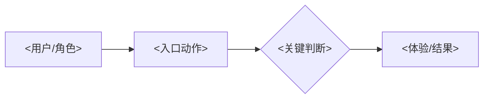

# <产品/能力名称> 产品需求评审

| 项目 | 内容 |
| --- | --- |
| 文档状态 | `DRAFT` / `IN REVIEW` / `DECIDED`（不等于实施授权） |
| 讨论草稿 | <已有discuss则引用路径及有效决定编号或章节；未建立则注明并引用实际PRD/TD等来源，不补造稿件> |
| 已确认范围 / 仍待确认 | <逐项标注，不以整稿状态覆盖WIP> |
| 产品负责人 | <姓名/团队> |
| 调研/数据来源 | [<链接或路径>](<链接或路径>) |
| 技术详情（同稿章节；按需） | <同稿章节锚点；不适用则省略，不另建稿件> |

# 会议决策面

## 1. 产品结论

<用一句话说明：谁通过什么核心策略获得什么结果，以及希望本次会议确认什么。>

| 决策项 | 结论/候选方案 | 状态 | 需要谁确认 |
| --- | --- | --- | --- |
| <事项> | <结论> | `DECIDED` / `OPEN` | <角色> |

## 2. 本期目标与范围

| 类别 | 内容 |
| --- | --- |
| 目标用户/角色 | <谁在何时何地使用> |
| 本期目标 | <可验证的用户/业务结果> |
| 必要性与取舍 | <当前问题与不做的影响；硬约束及最小满足方案，不把问题真实等同于方案必要> |
| 成功标准 | <指标、目标值或验收条件；判断方式和反馈时机，区分早期信号与最终结果，不填实施实测结果> |
| 本期不做 | <明确排除的用户、渠道、能力或自动化> |

> 未来候选留同一discuss或既有backlog，不自动成为本期WIP、依赖或新文档。若影响当前重大选择，只将该当前未决选择列入WIP；是否成为会议议题仍由Owner决定。最小方案仍满足完整批准目标与必要保护。

## 3. 主用户流程

> 源材料已有且能直接解释主流程的原型或截图，应优先放在这里；写清每张图覆盖的场景，不要为了填充本节临时补画。

1. <谁在什么条件下触发。>
2. <用户看到的关键操作和系统行为。>
3. <最终体验、记录或后续动作。>

## 4. 边界与责任（按需使用）

> 仅在用户、团队、系统、数据或第三方之间存在真实边界时使用；不要用代码分层代替责任边界。

| 主题 | 本期规则 | 边界/不做 | 责任方 |
| --- | --- | --- | --- |
| <主题> | <规则> | <排除项> | <角色/系统> |

## 5. 待决策点

> 首次重构时，Agent 不自动填写本节。仅当文档 Owner 从下方 `WIP` 中明确挑选出需要开会讨论的事项时，才移入本表。

| 待决策点 | 推荐 | 为什么需要会议确认 | 需要谁确认 |
| --- | --- | --- | --- |
| <问题> | <建议及原因> | <仍存在的取舍或需要共同确认的边界> | <角色> |

> **WIP｜会前需人工处理**
>
> - **[矛盾 / 缺口 / 未核验 / 语义不清 / 潜在待决策]** <问题>
>   - 证据：<来源章节、数据或互相冲突的表述>
>   - 需要人工处理：<需要确认或统一的内容>
>   - 推荐：<建议直接确认写入正文，或建议移入待决策点；说明原因>
>   - 由文档 Owner 决定：<直接回写正文 / 移入待决策点 / 保留 WIP>

# 产品详情页

## A. 背景、证据、用户与场景

| 用户/角色 | 触发 | 当前痛点 | 期望结果 | 证据 |
| --- | --- | --- | --- | --- |
| <角色> | <触发> | <痛点> | <结果> | <链接/路径> |

## B. 功能详情

| 项目 | 内容 |
| --- | --- |
| 前置条件 | <权限、数据、状态或配置条件> |
| 用户操作 | <步骤> |
| 业务规则 | <完整规则和例外> |
| 输出 | <体验、数据或下游影响> |
| 失败/降级 | <反馈和恢复方式> |
| 度量 | <事件和指标定义> |

## C. 原型与详细流程

<原型链接/图片、交互说明、异常路径和状态变化。>

## D. 依赖与非功能需求

| 依赖/约束 | 所需内容 | 当前状态 | 待补充/说明 |
| --- | --- | --- | --- |
| <系统/设计/法务/运营> | <内容> | <状态> | <需要补齐的事实或约束> |

## E. 验收标准与发布观察要求

| 场景 | 操作 | 预期结果 | 验证方式/所需证据 |
| --- | --- | --- | --- |
| <正常/边界场景> | <操作> | <结果> | <记录/数据/测试> |
